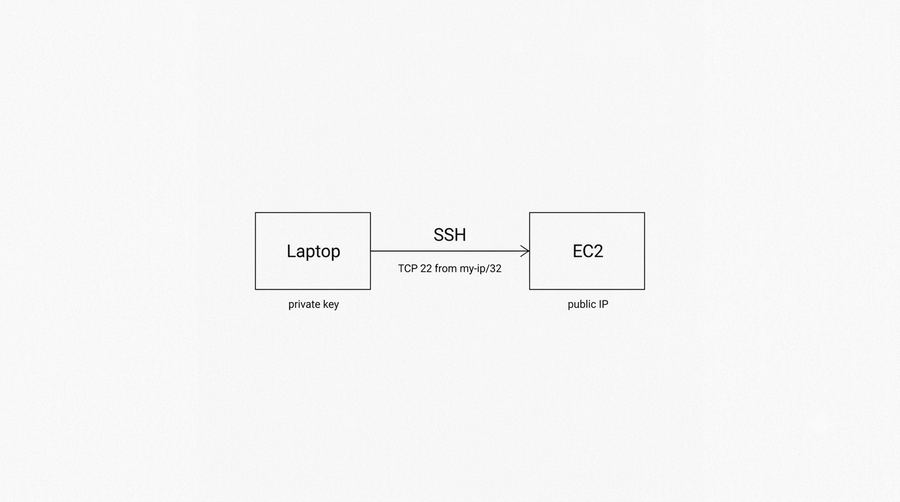

# EC2 SSH Access with Terraform

<p align="center">
  
</p>

This lab creates a simple Ubuntu EC2 instance and makes it accessible over SSH.

The goal is to understand how Terraform can:

- Find your current public IP address
- Create a security group that allows SSH only from your IP
- Upload your public SSH key to AWS
- Create an Ubuntu EC2 instance
- Output the SSH command you can use to connect

## What this lab creates

```text
Devops Laptop
      |
      | terraform apply
      v
Terraform
      |
      | gets current public IP
      v
checkip.amazonaws.com
      |
      | creates AWS resources
      v
AWS
├── Default VPC
├── Security Group
│   └── TCP 22 from my-ip/32
├── EC2 Key Pair
└── Ubuntu EC2 Instance
      ^
      |
      | ssh -i ~/.ssh/terraform-ec2 ubuntu@<public-ip>
      |
Developer/Devops Laptop :)
```

## Why use `/32`?

AWS security groups expect CIDR notation.

If my public IP is:

```text
203.0.113.10
```

Terraform turns it into:

```text
203.0.113.10/32
```

`/32` means:

```text
only this one IP address
```

So the SSH rule becomes:

```text
Allow TCP 22 only from my current public IP
```

This is safer than:

```text
0.0.0.0/0
```

because `0.0.0.0/0` means anyone on the internet can try to reach port `22`.

## How Terraform gets my IP

This lab uses the HTTP provider:

```hcl
data "http" "my_ip" {
  url = "https://checkip.amazonaws.com"
}
```

The response usually includes a newline at the end, so we use `chomp()`:

```hcl
locals {
  my_ip_cidr = "${chomp(data.http.my_ip.response_body)}/32"
}
```

Example result:

```text
203.0.113.10/32
```

## SSH key idea

The private key stays on my laptop:

```text
~/.ssh/terraform-ec2
```

Only the public key is uploaded to AWS:

```text
~/.ssh/terraform-ec2.pub
```

Terraform registers that public key as an EC2 key pair.

## Generate SSH key

```bash
ssh-keygen -t ed25519 -f ~/.ssh/terraform-ec2
chmod 600 ~/.ssh/terraform-ec2
```

## Run the lab

```bash
terraform init
terraform apply
```

## Connect to the instance

After Terraform finishes, use the output:

```bash
terraform output ssh_command
```

It should look like this:

```bash
ssh -i ~/.ssh/terraform-ec2 ubuntu@<public-ip>
```

## Important notes

The public IP created with:

```hcl
associate_public_ip_address = true
```

is not an Elastic IP.

It is an auto-assigned public IPv4 address. It can change if the instance is stopped and started again.

For this lab, that is fine.

For production, better options are usually:

- AWS SSM Session Manager
- Tailscale
- Bastion host
- Private subnet access
- Short-lived SSH certificates

## Production reminder

This lab is for learning.

In production, avoid exposing SSH directly to the internet when possible.

A better production-style pattern is:

```text
Private EC2 instance + SSM Session Manager + IAM/SSO + MFA + audit logs
```

## Clean up

When finished:

```bash
terraform destroy
```

This removes the EC2 instance, security group, and key pair created by the lab.
