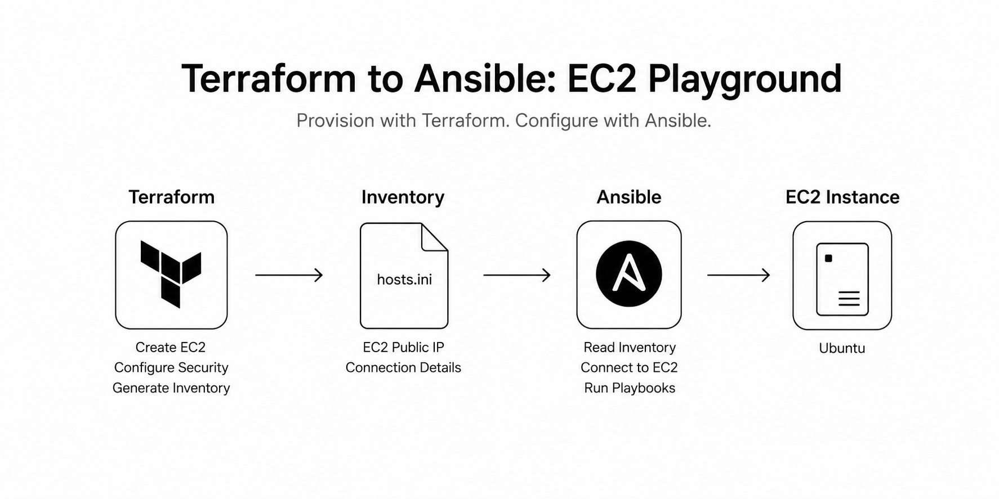

# Terraform to Ansible — EC2 Playground

<p align="center">
  
</p>

In the [previous lab](https://github.com/DanielHemmati/yakstack/tree/main/labs/ec2-ssh-access), we created an EC2 instance and connected to it using SSH from our own public IP address.

In this lab, we take that one step further.

Terraform will create the EC2 instance, generate an Ansible inventory file, and then Ansible will use that inventory file to connect to the instance.

The goal is not to configure anything advanced yet.

The goal is simply to create a small playground for learning Ansible.

---

## Small diagram

```text
Local machine
     |
     | SSH using local private key
     v
EC2 instance
```

---

## The Main Idea

We already have an SSH key from the previous lab:

```bash
~/.ssh/terraform-ec2
```

If you haven't created yet use:

```bash
ssh-keygen -y -f ~/.ssh/terraform-ec2 > ~/.ssh/terraform-ec2.pub
```

That is the private key.

The private key should stay on our local machine.

We do **not** copy the private key into the EC2 instance.

AWS only needs the matching public key:

```bash
~/.ssh/terraform-ec2.pub
```

Terraform will register that public key in AWS as an EC2 key pair.

Then Ansible will use the local private key to connect to the EC2 instance.

---

## Project Structure

```text
terraform-to-ansible-ec2-playground/
├── main.tf
├── providers.tf
├── outputs.tf
├── hosts.ini        # generated by Terraform
└── playbook.yml
```

---

## Prerequisites

You need:

- Terraform installed
- Ansible installed
- AWS credentials configured
- An existing SSH key pair locally

Check your private key:

```bash
ls -l ~/.ssh/terraform-ec2
```

Check your public key:

```bash
ls -l ~/.ssh/terraform-ec2.pub
```

If the public key does not exist, generate it from the private key:

```bash
ssh-keygen -y -f ~/.ssh/terraform-ec2 > ~/.ssh/terraform-ec2.pub
```

Make sure the private key has the correct permission:

```bash
chmod 600 ~/.ssh/terraform-ec2
```

---

## `terraform.tf`

```hcl
terraform {
  required_providers {
    aws = {
      source  = "hashicorp/aws"
      version = "~> 5.0"
    }

    http = {
      source  = "hashicorp/http"
      version = "~> 3.0"
    }

    local = {
      source  = "hashicorp/local"
      version = "~> 2.0"
    }
  }
}

```

We use three providers here:

- `aws` to create AWS resources
- `http` to get our current public IP address
- `local` to generate the Ansible inventory file

---

## `main.tf`

```hcl
data "http" "my_ip" {
  url = "https://checkip.amazonaws.com"
}

data "aws_vpc" "default" {
  default = true
}

data "aws_subnets" "default" {
  filter {
    name   = "vpc-id"
    values = [data.aws_vpc.default.id]
  }
  filter {
    name   = "availability-zone"
    values = ["us-east-1a"]
  }
}

data "aws_ami" "ubuntu" {
  most_recent = true
  owners      = ["099720109477"] # Canonical

  filter {
    name   = "name"
    values = ["ubuntu/images/hvm-ssd-gp3/ubuntu-noble-24.04-amd64-server-*"]
  }

  filter {
    name   = "virtualization-type"
    values = ["hvm"]
  }
}

resource "aws_key_pair" "this" {
  key_name   = "terraform-ec2"
  public_key = file(pathexpand("~/.ssh/terraform-ec2.pub"))
}

resource "aws_security_group" "ssh" {
  name        = "ansible-ec2-playground-sg"
  description = "Allow SSH from my public IP"
  vpc_id      = data.aws_vpc.default.id

  ingress {
    description = "SSH from my public IP"
    from_port   = 22
    to_port     = 22
    protocol    = "tcp"
    cidr_blocks = ["${chomp(data.http.my_ip.response_body)}/32"]
  }

  egress {
    description = "Allow all outbound traffic"
    from_port   = 0
    to_port     = 0
    protocol    = "-1"
    cidr_blocks = ["0.0.0.0/0"]
  }

  tags = {
    Name = "ansible-ec2-playground-sg"
  }
}

resource "aws_instance" "ubuntu" {
  ami                         = data.aws_ami.ubuntu.id
  instance_type               = "t2.micro"
  subnet_id                   = data.aws_subnets.default.id
  vpc_security_group_ids      = [aws_security_group.ssh.id]
  key_name                    = aws_key_pair.this.key_name
  associate_public_ip_address = true

  tags = {
    Name = "ansible-ec2-playground"
  }
}

resource "local_file" "ansible_inventory" {
  filename = "${path.module}/hosts.ini"

  content = <<EOF
[ec2]
${aws_instance.ubuntu.public_ip}

[ec2:vars]
ansible_user=ubuntu
ansible_ssh_private_key_file=~/.ssh/terraform-ec2
ansible_python_interpreter=/usr/bin/python3.12
EOF
}
```

---

## Run the Lab

Initialize Terraform:

```bash
terraform init
```

Apply the Terraform configuration:

```bash
terraform apply
```

After Terraform finishes, it will create `hosts.ini`.

Check the generated inventory file:

```bash
cat hosts.ini
```

It should look similar to this:

```ini
[ec2]
54.210.64.39

[ec2:vars]
ansible_user=ubuntu
ansible_ssh_private_key_file=~/.ssh/terraform-ec2
ansible_python_interpreter=/usr/bin/python3.12
```

---

## Test SSH Manually

Before using Ansible, test SSH manually:

```bash
ssh -i ~/.ssh/terraform-ec2 ubuntu@<EC2_PUBLIC_IP>
```

If SSH works, Ansible should also work.

---

## Test Ansible

Run the Ansible ping module:

```bash
ansible -i hosts.ini ec2 -m ping
```

Expected result:

```json
<some_IP> | SUCCESS => {
    "changed": false,
    "ping": "pong"
}
```

This means Ansible successfully connected to the EC2 instance.

---

## Why This Lab Matters

This lab teaches the basic workflow:

```text
Terraform creates infrastructure.
Terraform writes connection information into an inventory file.
Ansible uses that inventory file to connect to the server.
```

That is the core idea behind using Terraform and Ansible together.

In this lab, we only test the connection.

Later, we can use this same playground to install packages, configure services, deploy apps, and experiment with Ansible playbooks.

---

## Cleanup

When finished, destroy the infrastructure:

```bash
terraform destroy
```

This removes the EC2 instance, security group, and AWS key pair resource.

The local SSH key remains on your machine.

---

## Notes

This lab intentionally keeps things simple.

It does not use:

- dynamic inventory
- Ansible roles
- custom VPCs
- provisioners
- Packer
- CI/CD

It will get more fun but first we have to build the foundation.
