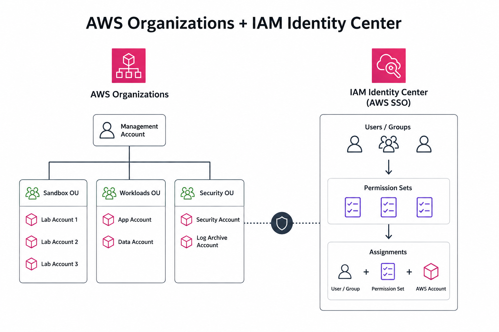

# AWS Organizations + IAM Identity Center Terraform Lab

This Terraform project provisions a small AWS Organizations and IAM Identity Center setup for a development account lab. It creates an organizational unit, a new AWS member account, an Identity Store user, a permission set, and an account assignment that gives the user access to the account through IAM Identity Center.

## What It Creates

| Resource | Description |
| --- | --- |
| `aws_organizations_organizational_unit.test` | Creates a `test` OU under the organization root. |
| `aws_organizations_account.ada_dev` | Creates an `ada-dev` AWS member account inside the `test` OU. |
| `aws_identitystore_user.ada_dev` | Creates the `ada-dev` IAM Identity Center user. |
| `aws_ssoadmin_permission_set.power_user` | Creates a `PowerUserAccess` permission set with an 8-hour session duration. |
| `aws_ssoadmin_managed_policy_attachment.power_user` | Attaches the AWS managed `PowerUserAccess` policy to the permission set. |
| `aws_ssoadmin_account_assignment.ada_dev_power_user` | Assigns the user and permission set to the `ada-dev` account. |

## Project Files

| File | Purpose |
| --- | --- |
| `versions.tf` | Pins Terraform and the AWS provider requirements. |
| `provider.tf` | Configures the AWS provider in `us-east-1`. |
| `dependencies.tf` | Reads the current AWS Organization and IAM Identity Center instance. |
| `main.tf` | Defines the OU, account, user, permission set, policy attachment, and assignment. |
| `outputs.tf` | Exposes useful organization, account, Identity Center, and permission set values. |
| `tf-state-import.sh` | Imports an existing permission set and managed policy attachment into Terraform state. |

## Prerequisites

Before applying this project, make sure you have:

1. Terraform `>= 1.15.0, < 2.0.0`.
2. AWS CLI credentials authenticated against the AWS Organizations management account.
3. Permission to manage AWS Organizations accounts and organizational units.
4. IAM Identity Center enabled in the target AWS region.
5. Permission to manage IAM Identity Center users, permission sets, and account assignments.

The AWS provider is configured for `us-east-1`. If your IAM Identity Center instance is in another region, update `provider.tf` before running Terraform.

## Usage

Initialize Terraform:

```bash
terraform init
```

Preview the changes:

```bash
terraform plan
```

Apply the configuration:

```bash
terraform apply
```

After apply completes, Terraform will output the organization ID, account ID, account ARN, Identity Center instance ARN, Identity Store ID, user ID, and permission set ARN.

## State Import Helper

The `tf-state-import.sh` script is a helper for importing an existing IAM Identity Center permission set and its managed policy attachment into Terraform state. It is only useful when those resources already exist outside this Terraform configuration.

## Important Notes

The account email is currently defined in `main.tf` as:

```hcl
locals {
  email = "user@example.com"
}
```

AWS account emails must be globally unique. Change this value before reusing the lab in another environment.

The member account resource has `close_on_deletion = true`. Destroying this Terraform stack can request closure of the AWS account. Review AWS account closure behavior before running `terraform destroy`.

## Cleanup

To remove the resources managed by this project:

```bash
terraform destroy
```

Use cleanup carefully because this project manages an AWS Organizations member account, IAM Identity Center access, and account assignments.
