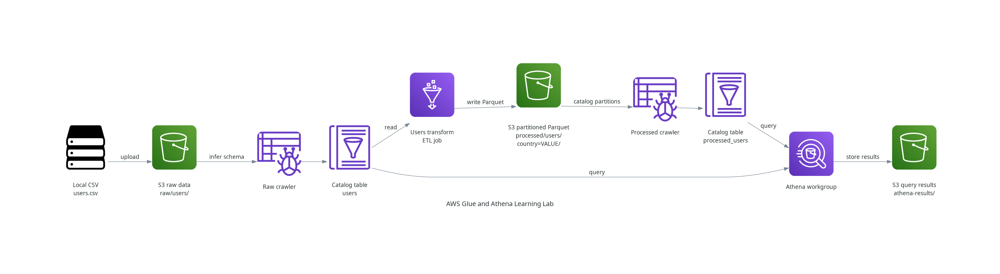

# AWS Glue and Athena Learning Lab

This lab uses Terraform to build a small AWS data pipeline. AWS Glue converts raw CSV data into country-partitioned Parquet data. Amazon Athena queries both datasets through the AWS Glue Data Catalog.

## Architecture



S3 stores the data. The crawlers inspect files and store table metadata in the Glue Data Catalog. The ETL job cleans the CSV records and writes Parquet files. Athena uses the catalog metadata to query the S3 files.

## Deploy

Requirements:

- Terraform
- AWS CLI with valid credentials
- Permission to create the resources in this project

Deploy the infrastructure:

```bash
terraform -chdir=terraform init
terraform -chdir=terraform plan
terraform -chdir=terraform apply
```

Upload the source CSV:

```bash
./scripts/upload-data.sh
```

## Run The Pipeline

Run the raw-data crawler first. It creates the `users` table that the ETL job reads.

```bash
aws glue start-crawler \
  --name "$(terraform -chdir=terraform output -raw glue_crawler_name)" \
  --region us-east-1
```

Wait until the crawler state is `READY`:

```bash
aws glue get-crawler \
  --name "$(terraform -chdir=terraform output -raw glue_crawler_name)" \
  --region us-east-1 \
  --query 'Crawler.State' \
  --output text
```

Start the ETL job:

```bash
aws glue start-job-run \
  --job-name "$(terraform -chdir=terraform output -raw glue_etl_job_name)" \
  --region us-east-1
```

Use the returned `JobRunId` to check the job:

```bash
aws glue get-job-run \
  --job-name "$(terraform -chdir=terraform output -raw glue_etl_job_name)" \
  --run-id <JOB_RUN_ID> \
  --region us-east-1 \
  --query 'JobRun.JobRunState' \
  --output text
```

After the job succeeds, run the processed-data crawler. It creates the `processed_users` table and registers each country partition.

```bash
aws glue start-crawler \
  --name "$(terraform -chdir=terraform output -raw processed_users_crawler_name)" \
  --region us-east-1
```

## Athena Queries

Use the workgroup from `terraform -chdir=terraform output -raw athena_workgroup_name`.

Query the raw CSV table:

```sql
SELECT *
FROM users;
```

Query the processed Parquet table:

```sql
SELECT *
FROM processed_users;
```

Calculate the average age for each country:

```sql
SELECT country, AVG(age) AS average_age
FROM processed_users
GROUP BY country
ORDER BY country;
```

Filter by the partition column so Athena reads only one country partition:

```sql
SELECT *
FROM processed_users
WHERE country = 'GERMANY';
```

## What Glue Does

1. The raw crawler reads the CSV files under `raw/users/`.
2. The crawler infers the CSV schema and creates the `users` catalog table.
3. The ETL job reads `users` through the Glue Data Catalog.
4. The job removes null rows, converts `age` to an integer, and changes `country` to uppercase.
5. The job writes compressed Parquet files under paths such as `country=GERMANY/`.
6. The processed crawler reads the Parquet schema and registers `country` as a partition key.
7. Athena uses `processed_users` to query the partitioned Parquet files.

Parquet reduces the amount of data Athena must read when a query selects only some columns. Partition filtering reduces it further by skipping country directories that the query does not need.

## Cost Note

AWS charges for Glue job runtime, crawler runtime, Athena data scanned, and S3 usage. Destroy the lab when you finish:

```bash
terraform -chdir=terraform destroy
```
