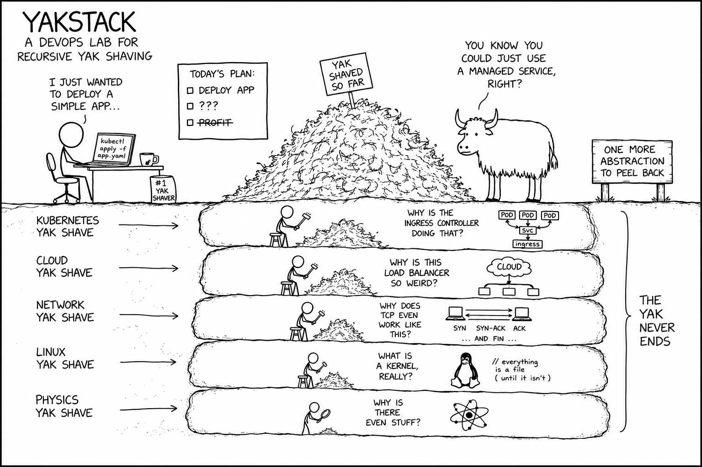

# Yakstack

<p align="center">
  
</p>

Yakstack is my hands-on Devops/DevSecOps/SRE/Platform Engineering/Mlops, <some_name>Ops 😂 learning repository.

It is where I experiment with infrastructure, automation, kubernetes, CI/CD, gitops, observability, security, ...
Basically **anything that improves the software delivery.**

The goal is not only to learn tools, but to understand how they work together in real-world systems.

## Repository structure

```txt
.
├── assets
├── labs
├── patterns
└── projects
```

`labs/`

Small, focused experiment use to learn or test one concept. Here our goal is not to be production ready
but to just make it work and see how it does work.

Example:

- [k8s readiness and liveness probe](https://github.com/DanielHemmati/yakstack/tree/main/labs/01-readiness-liveness-probe)
- [EC2 ssh access](https://github.com/DanielHemmati/yakstack/tree/main/labs/02-ec2-ssh-access)
- [How terraform, ansible setup work together](https://github.com/DanielHemmati/yakstack/tree/main/labs/03-tf-ansible-playground)
- And many more on `labs/` folder

A lab should be easy to run, understand, and remove.

`patterns/`

Reusable solutions to common infrastructure and DevOps problems. For example my current terraform EC2 creation
can be a pattern (not good for production, but good for labs for now)

`projects/`

Complete, end-to-end implementations that solve a larger problem. The goal here is to be production ready.
Here we will run tailscale to access resources, will use AWS SSM to run ansible playbook and all of our secrets
will be in AWS secret manager or vault, if we write terraform we will terratest, OPA, ...

Every step matters here: every project should be secure, observable, reliable, reproducible, and built with production-grade practices in mind.

`assets/`

Just the header image
