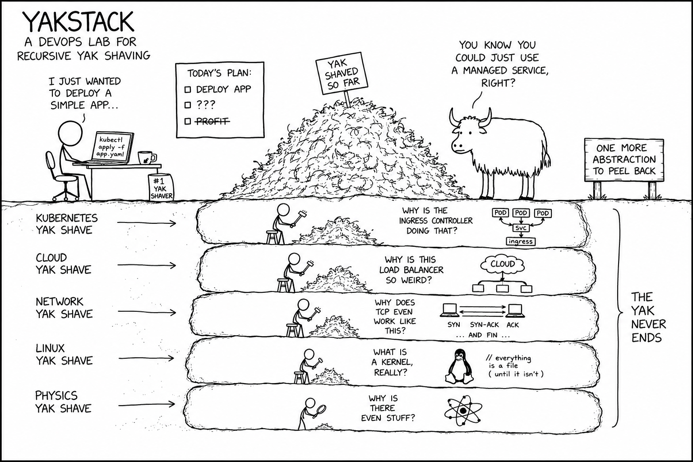

# Yakstack

<p align="center">
  
</p>

Yakstack is my hands-on DevOps/DevSecOps/SRE/Platform Engineering/MLOps, <some_name>Ops 😂 learning repository.

It is where I experiment with infrastructure, automation, Kubernetes, CI/CD, GitOps, observability, security, ...
Basically **anything that improves software delivery.**

The goal is not only to learn tools, but to understand how they work together in real-world systems.

## Repository structure

```txt
.
├── assets
├── labs
├── patterns
└── projects
```

`labs/`

Focused experiments used to learn or test concepts. Here, our goal is not to be production-ready
but to just make it work and expand on other ideas.

Example:

- [Kubernetes readiness and liveness probes](https://github.com/DanielHemmati/yakstack/tree/main/labs/01-readiness-liveness-probe)
- [EC2 SSH access](https://github.com/DanielHemmati/yakstack/tree/main/labs/02-ec2-ssh-access)
- [How Terraform and Ansible work together](https://github.com/DanielHemmati/yakstack/tree/main/labs/03-tf-ansible-playground)
- And many more in the `labs/` folder

A lab should be easy to run, understand, and remove.

`assets/`

Just the header image.

## Shared Python tooling

Python tools used across labs and projects are managed once from the repository root with
[uv](https://docs.astral.sh/uv/). The `diagrams` package and the Graphviz renderer are available
from every subdirectory:

```bash
# Install or update the shared environment
uv sync

# Run a diagram script from the repository root or any lab/project directory
uv run python diagram.py
```

You can also activate the shared environment for a shell session:

```bash
source "$(git rev-parse --show-toplevel)/.venv/bin/activate"
```
